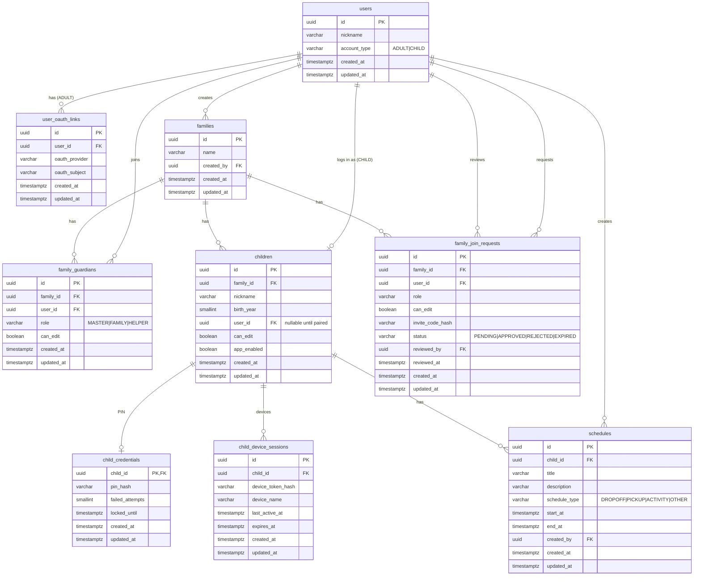

# Database ERD

## Entity Relationship Diagram

## Redis (not in RDB)

| Key | Value | TTL |
|-----|-------|-----|
| `invite:{code}` | `{ familyId, role, canEdit, invitedBy }` | 24h |
| `pair:{code}` | `{ childId, familyId, issuedBy }` | 5–10min |

## Flyway migrations

| Version | File |
|---------|------|
| V1 | `V1__create_users_and_oauth_links.sql` |
| V2 | `V2__create_families_and_guardians.sql` |
| V3 | `V3__create_family_join_requests.sql` |
| V4 | `V4__create_children_and_auth.sql` |
| V5 | `V5__create_schedules.sql` |

## JPA entities

Package: `com.kidschedule.api.domain.entity`

- `User`, `UserOauthLink`
- `Family`, `FamilyGuardian`, `FamilyJoinRequest`
- `Child`, `ChildCredential`, `ChildDeviceSession`
- `Schedule`

Enums: `com.kidschedule.api.domain.enums`
