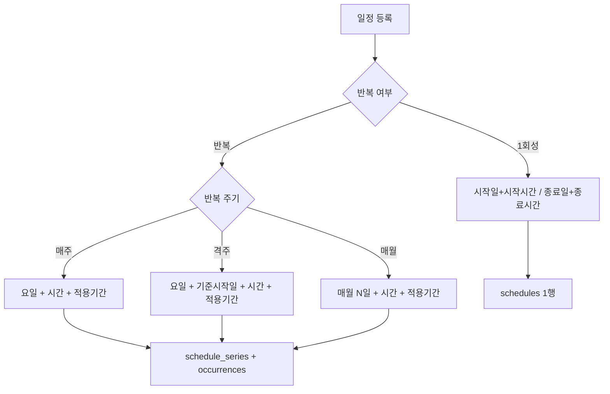

# 학원·일정·귀가 DB 설계 및 구현 계획

> **모바일/PC Cursor 공용 문서.** 새 Agent 채팅 시작 시 `docs/project-context.md`와 함께 읽기.
>
> 상태: **설계 확정, 구현 전** (V6 마이그레이션부터 착수)

## 합의된 방향

| 항목 | 결정 |
|------|------|
| 학원 | **별도 `academies` 테이블** 추가 |
| 귀가 일정 | **기존 `schedules` 활용** (`schedule_type = PICKUP`, `pickup_guardian_id`) |
| 일정 목록 | 학원 수업(ACTIVITY) + 귀가(PICKUP) **함께 표시** |
| 홈 「귀가 일정」 | 오늘자 **PICKUP만 요약** (별도 테이블 없음) |
| 반복 패턴 | **매주 / 격주 / 매월 N일** + **1회성** |
| 매월 반복 | **매월 N일** 방식 (N번째 요일은 제외) |
| 이전 일정 UI | **하이브리드 (확정)**: 완료 기본 접기 + 최근 완료 1건 peek + 「이전 N개 보기」펼치기 |
| 학원 찾기 | **기존 선택 우선** + 없으면 신규 등록; 선택 시 academy 마스터에서 pre-fill |

---

## UX 결정

### 1) 이전 일정 — 하이브리드 (확정)

1. **기본:** `UPCOMING` + `IN_PROGRESS`만 풀 카드 (시작시간 순)
2. **완료:** 접힌 상태 — `총 N개의 이전일정 보기`
3. **peek:** 접힌 상태에서 **가장 최근 완료 1건** opacity ~40% + gradient clip
4. **펼치기:** 완료 전체 연한 스타일

API: `GET /schedules?date=` → `{ upcoming[], inProgress[], completed[] }`

### 2) 학원 찾기

- 기존 academy 선택 → name / default_category / phone **pre-fill** (title은 editable)
- 없으면 신규 입력 + 「학원 목록에 저장」옵션
- 학원 미연결 수기 일정도 허용 (`academy_id` NULL)

**폼 상태**

| 상태 | academy_id | 카테고리 | 연락처 |
|------|------------|----------|--------|
| A. 기존 학원 선택 | FK | pre-fill, override 가능 | academy.phone |
| B. 신규 + 목록 저장 | 새 FK | academy + schedule 저장 | 입력값 |
| C. 수기 | NULL | 직접 선택 | schedule에만 |

`academies.default_subject_category` → pre-fill. `schedules.subject_category`는 **일정 확정값**(스냅샷).

---

## 일정 등록 UX 분기

---

## 데이터 모델 (V6)

현재 `V5__create_schedules.sql`는 단일 occurrence만 가정. **series + occurrence** 2계층.

### `academies` (신규)

- `family_id`, `name`, `phone`, `default_subject_category`, `memo`

### `schedule_series` (신규)

| 컬럼 | 용도 |
|------|------|
| `recurrence_type` | `WEEKLY`, `BIWEEKLY`, `MONTHLY` |
| `days_of_week` | bitmask — WEEKLY/BIWEEKLY |
| `day_of_month` | 1–31 — MONTHLY |
| `anchor_date` | 격주 기준일 |
| `start_time`, `end_time` | KST local time |
| `effective_from`, `effective_until` | 적용 기간 |
| `schedule_type` | `ACTIVITY` / `PICKUP` |
| `pickup_guardian_id` | PICKUP 시 |
| `academy_id`, `subject_category` | ACTIVITY 시 |

### `schedules` (확장)

- 1회성: `series_id = NULL`
- 반복: `series_id` FK + materialized occurrences
- 추가: `academy_id`, `subject_category`, `pickup_guardian_id`, `series_id`

### `subject_category` enum

`LANGUAGE`, `MATH`, `ENGLISH`, `SOCIAL`, `SCIENCE`, `MUSIC`, `ART`, `PE`, `SECOND_LANGUAGE`, `OTHER`

### 일정 상태 (API 계산)

- `IN_PROGRESS` (수업중): `start_at <= now < end_at`
- `COMPLETED` (완료): `now >= end_at`
- `UPCOMING` (예정): `now < start_at`

---

## occurrence 생성

- series 생성 시 **12주** ahead materialize (`app.schedule.horizon-weeks`)
- 단건 수정: 해당 `schedules` 행만 UPDATE
- series 수정: series UPDATE + 미래 occurrence 재생성
- 단건 삭제: `cancelled` flag 권장 (반복 예외)

---

## Backend API (구현 순서)

### Phase 1 — 기반

1. Flyway **V6** + JPA
2. `AcademyController` — `/api/v1/families/{familyId}/academies`
3. Family/Child bootstrap

### Phase 2 — 일정

4. `ScheduleController` — CRUD, calendar counts, grouped list
5. `ScheduleSeriesService` — recurrence expansion
6. `GET /families/{id}/academies?query=` — 학원찾기

### Phase 3 — 홈

7. `GET /api/v1/home` — now/next/todayCount + 오늘 PICKUP 요약

---

## Mobile (구현 시)

| 화면 | 추가 UI |
|------|---------|
| 일정 등록 | 1회성/반복 토글, 학원/귀가 유형 |
| 일정 목록 | PICKUP 구분, 하이브리드 completed UI |
| 학원찾기 | 검색/선택/신규 모달 |
| 학원관리 | academies CRUD |

---

## 리스크 / 주의

- 타임존: KST → `timestamptz`
- 매월 31일: 2월 등 **말일 보정 정책** 구현 전 확정
- 격주: `anchor_date` + parity
- 1회성만 종료일 UI; 반복은 `effective_until`

---

## 구현 TODO

- [ ] V6 Flyway: academies, schedule_series, schedules 확장
- [ ] Academy CRUD + Family bootstrap
- [ ] ScheduleSeriesService (WEEKLY → BIWEEKLY → MONTHLY)
- [ ] Schedule API + calendar + grouped list
- [ ] Home dashboard API
- [ ] Mobile 일정/홈 UI
